# Pipeline — from microphone to caption

How one second of audio becomes a caption on screen. Every number here is the shipped default
from `config/config.default.json`.

> **Dashed nodes are off unless you turn them on.** Each names the setting that enables it, so a
> box can be checked against your own config without leaving the diagram. On a stock install the
> solid path is the whole system: microphone → Whisper → SQLite → browser, translated locally by
> the NMT model. No second machine, no LLM, no speech output, no file move.

- [Four processes, not one](#four-processes-not-one)
- [Live audio to a saved row](#live-audio-to-a-saved-row)
- [Three ways a row gets written](#three-ways-a-row-gets-written)
- [Why a row was hidden](#why-a-row-was-hidden)
- [Calibration — the other thing that stops transcription](#calibration--the-other-thing-that-stops-transcription)
- [Where the models actually run](#where-the-models-actually-run)
- [Delivery](#delivery)
- [Who can reach what](#who-can-reach-what)
- [Translation](#translation)
- [Two machines](#two-machines)
- [What flows back](#what-flows-back)
- [Three timestamps](#three-timestamps)
- [What is being measured](#what-is-being-measured)
- [Batch file transcription is a different pipeline](#batch-file-transcription-is-a-different-pipeline)
- [On stop](#on-stop)
- [Where each stage lives](#where-each-stage-lives)

---

## Four processes, not one

The most misleading thing about reading the source top to bottom: capture and transcription do
not run in the web server. They run in a separate spawned process, and the two communicate only
through a `multiprocessing.Manager` dict and the session database.

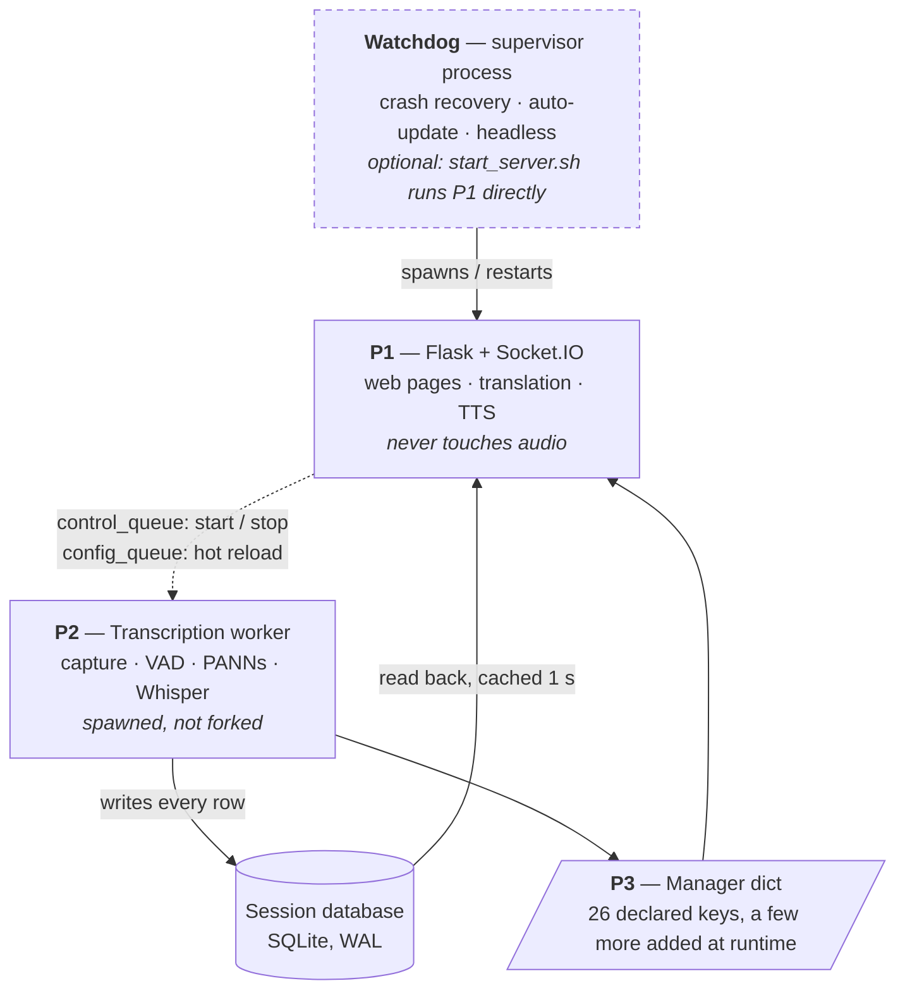

**The watchdog is a deployment choice, not a requirement.** `start_server.sh` launches the
server directly; the watchdog exists for unattended installs that need crash recovery and
auto-update. Everything below happens either way.

**Why spawn, not fork.** A forked child inherits the parent's CUDA context and dies on
`Cannot re-initialize CUDA in forked subprocess`, so the start method is forced to `spawn` and
shared objects are passed as pickled arguments instead of inherited.

---

## Live audio to a saved row

All inside the worker process. Dotted arrows are influences rather than data hand-offs.

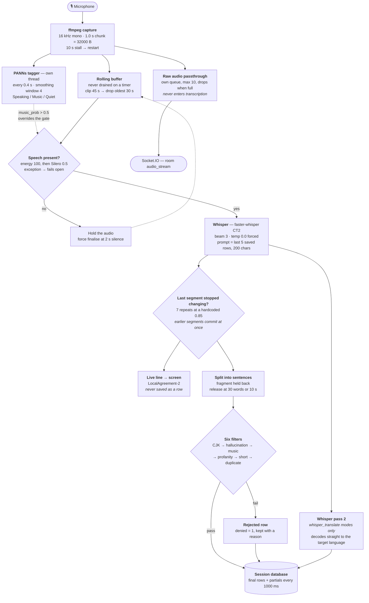

**Music overrides the gate — once the model is present.** The CNN14 checkpoint is a separate
~327 MB download, not shipped with the source. Until it is downloaded `music_prob` stays `None`,
nothing overrides VAD, and singing that fails energy + Silero is dropped rather than
transcribed. With it, a confident reading forces the gate to accept, and
`transcribe_detected_music` then decides only whether the row is *shown*.

When the two disagree: the gate override tests the **raw** probability, while the `Music` label —
and therefore the `music:` deny — uses the **smoothed** average over the window.

**Both detectors can be switched off**, and PANNs degrades quietly. With `vad.enabled` false the
energy gate alone decides. If the PANNs checkpoint is missing the detector falls back to an
energy heuristic that reports only `Speaking` or `Quiet` — it **never claims `Music`** without
the real model, which is the answer to "why is nothing being tagged as music".

**Loudness normalisation** (off by default) boosts quiet audio toward `-20 dBFS`, capped so it
can never clip, and only on the copy handed to Whisper — the buffer, the energy gate and
calibration all still see raw levels. **Overlap de-duplication** runs before the sentence split,
trimming any prefix the new text shares with the last saved row or the held fragment.

---

## Three ways a row gets written

The chart above shows one finalisation node for clarity. There are actually three writers, each
running the full filter chain independently:

| Path | Fires when | Notes |
|------|-----------|-------|
| Segment batch | Whisper finalises one or more segments | The normal case; carries `words_json` |
| Phrase timeout | `phrase_timeout` (2 s) of silence | Recomputes its own confidence, speech type and word data |
| Stop flush | Session ends | Drains the held fragment; `words_json` is `NULL` |

---

## Why a row was hidden

A rejected row is written with a reason so the corrections page can restore it. `denied_reason`
is the complete vocabulary.

**Evaluation order and reason precedence are not the same.** CJK, hallucination and music are all
evaluated, then a fixed precedence decides which reason is recorded: **hallucination beats CJK
beats music**. A line that is both CJK-only and a known artefact stem is filed as
`hallucination`. `short` and `dup` are only reachable for a row that survived all three.

| Order | `denied_reason` | Fires when |
|-------|-----------------|------------|
| 1 | `cjk` | Any CJK characters, in **any** session — the language is never consulted. Transcribing Chinese, Japanese or Korean means turning `cjk_filter_enabled` off, or every row is stripped empty and denied |
| 1b | `cjk_shadow` | Partial strip: the cleaned text is saved *and* the original kept beside it |
| 2 | `hallucination` | Substring match against known artefact stems (subtitle credits, "thank you for watching") |
| 3 | `music:0.5` | Tagged Music while `transcribe_detected_music` is off. The threshold is baked into the reason so the corrections page can compare against the row's own value |
| 4 | *(none)* | Profanity filter — rewrites the text in place and keeps the verbatim original. Not a rejection |
| 5 | `short` | Fewer words than `min_words`. Off by default |
| 6 | `dup` | Fuzzy match ≥ 0.85 against anything already saved this session |

---

## Calibration — the other thing that stops transcription

Besides `stop`, calibration is the only thing that silently halts the transcription path. It
measures the room in two steps — noise floor, then speech — and while it runs **every chunk is
diverted before it reaches the rolling buffer**. Whisper sees nothing for the duration.

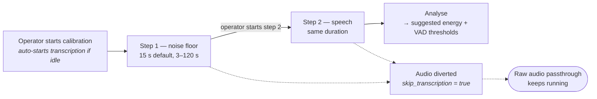

Raw audio passthrough is unaffected, so an operator monitoring the feed still hears the room.

---

## Where the models actually run

`use_gpu` is a **request, not a guarantee**. Each model walks the same ladder and silently takes
the first rung available, so the same config runs on three different devices depending on the
machine — and on a CPU-only box the whole contention story below simply does not apply.

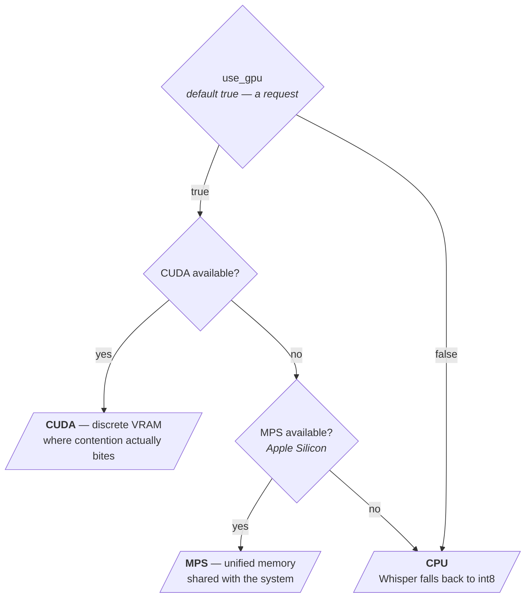

**The default Whisper backend has no MPS rung.** faster-whisper (CTranslate2) picks CUDA or CPU
only, so on Apple Silicon it runs int8 on CPU and never touches the GPU. The three-rung ladder
above applies to the NMT model and to the HuggingFace / openai-whisper backends.

PANNs is pinned to CPU by its own `device` setting regardless, and TTS defaults to cloud
Edge-TTS, so neither ever competes for the accelerator.

Precision follows the same pattern — asked for, not assumed. Whisper picks its own compute type
(`float16` on modern CUDA, `int8` on CPU), while the translation model ships at full precision:
`use_fp16` is `false` and `use_ctranslate2` is `false`, so both the half-precision and the CT2
backend are opt-in.

### What contends, when there is a CUDA card

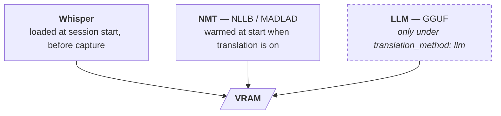

**With `translation_method: llm` the NMT fallback is deliberately not preloaded.** Measured on a
10 GB CUDA card: Whisper took 4202 MiB and NMT 3558 MiB, leaving 1976 MiB — the LLM never fit,
so every caption fell back to NMT forever. Those figures are CUDA-specific; under MPS the models
share system memory and the arithmetic is different, and on CPU nothing contends at all. The LLM's warm-up call carries its own long timeout for
the same reason: if it times out, NMT loads instead and takes the memory the LLM needed.

Unloading is triggered by a session stop, an explicit unload command, disabling translation,
switching method or model, or the last paired machine unpairing.

---

## Delivery

Text is only one of three things leaving the worker. Raw audio is forwarded on its own bounded
queue, and levels and status travel through the shared-state proxy without touching the database.

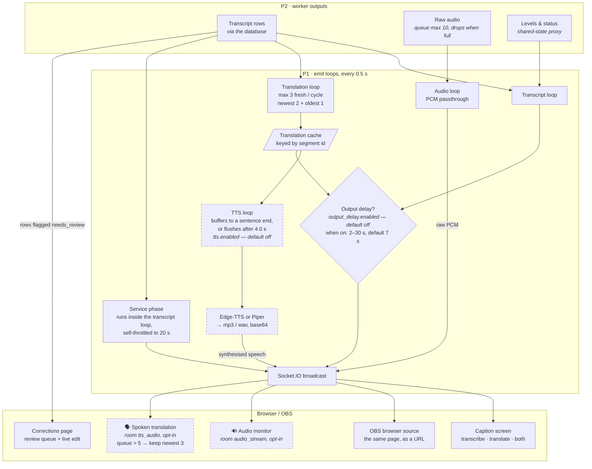

**The loops do not all tick at the same rate.** The transcript loop runs at
`web_server.update_interval` (0.5 s) and its database read is cached for 1 s, so it queries at
most once a second. The translation loop halves to 1 s when translation is disabled and bypasses
that cache, so it really does read every 0.5 s. The TTS loop uses a fixed 0.5 s, 1 s when idle.
The audio loop is not timed at all — it blocks on the queue and emits as chunks arrive.

**Speech output and the output delay are both off by default.** With stock settings this
diagram is just: rows → transcript loop → broadcast → caption screen.

**TTS is fed by the translation cache, not by rows** — it waits for translated text, buffers it
until the joined string ends on sentence punctuation, and only then synthesises, so the voice
does not stutter one fragment at a time. Enabling it mid-session skips history rather than
replaying it.

**Raw audio never enters transcription**, and is not even enqueued until a client asks for it —
the first `join_audio_stream` latches it on, and the latch is never cleared on leave, so once
anyone has listened the worker keeps filling the queue for the life of the process. A slow
browser drops frames rather than delaying a caption.

**Rooms** mean audio and speech only reach clients that explicitly joined — a caption screen is
never sent audio it will not play.

**Output delay** holds captions so an operator can correct a row before the audience ever sees
it. A row that simply ages out of the window keeps its original timestamp; only a row the
operator *approves* is rewritten — to `now − (delay + 1) s`, a synthetic time chosen to clear the
window, not the moment it was actually spoken.

**The bare host is not neutral.** Opening `/` with no query parameters redirects to whichever
display profile is marked active, and `/profile/<name>` expands a saved profile into URL
parameters. Both are unauthenticated by design — a projector should not need a login.

---

## Who can reach what

One function gates almost everything, and it tries three things in order. An empty IP whitelist
means *allow all*; localhost is always allowed.

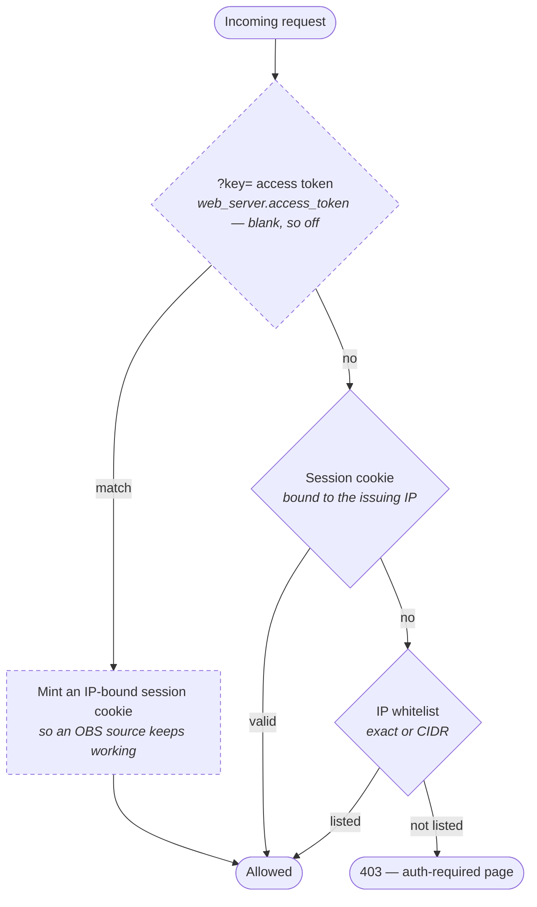

The access token ships blank, so by default the first gate is skipped and access is decided by
a password session or the IP whitelist.

Display surfaces are intentionally open — `/`, `/profile/<name>`, and the live status endpoint.
Everything that changes state is gated, including every mutating Socket.IO handler, which fails
closed. A **paired machine bypasses the whitelist entirely** for `/api/translate/*` and health,
authenticated instead by being in the trusted-client list.

Login is throttled at 5 failures per IP with a 30-second lockout, and if password auth is on
with a blank password, one is generated at boot and printed to the console.

---

## Translation

Four paths, one dispatcher. Declining is an ordinary outcome, not an error — a wrong caption in
front of a congregation is worse than a slower one.

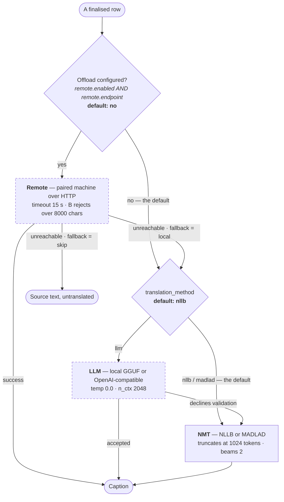

**On shipped defaults a caption never leaves the machine and never meets an LLM.** Offload is
opt-in and requires pairing; the LLM is opt-in and requires changing `translation_method`. Both
gates fail closed, so the everyday path is `row → NMT → caption`.

A machine that is *serving* a paired machine's request forces local translation, so a box acting
as both client and server cannot chain an offload onward.

**The fourth path skips all three.** In `whisper_translate` modes the translation is produced in
the worker by decoding the audio a second time, so it never reaches this dispatcher — the web
process only reads the result.

**The LLM's answer is thrown away when:**

| Rejected when | Because |
|---------------|---------|
| It refuses — *"I can't assist…"*, *"As an AI…"* | A refusal is not a translation |
| It narrates — *"Okay, let's…"*, *"Here's the translation:"* | Reasoning models ignore instructions to stop |
| Cyrillic survives into a Latin-script target | The source leaked through untranslated |
| The output is multi-paragraph | A caption is one utterance; a document is a recitation |
| It runs past `min(max(8, 3 × source words), source + 24)` | Commentary and recited scripture present as length. The floor of 8 stops a two-word caption getting a two-word budget |
| The input would not fit the context window | Checked *before* generating, so an overflow is a decline and never a crash — but **only on `provider: local`**. `n_ctx` sizes the in-process GGUF; an OpenAI-compatible endpoint, the shipped default, is not pre-checked |

Each caption is an independent two-message call — nothing accumulates between sentences, so
there is no context to clear.

**The glossary only applies to the NMT leg.** Forced terminology is a post-processing replace on
decoded NMT output — the LLM path, the remote path and both whisper-translate passes never see
it. Switching translation method silently turns it off.

**Switching target language mid-session does not clear the cache.** Already-translated rows keep
their old-language text through a stale-language fallback, so a transcript can legitimately end
up mixed; the per-row `translation_language` column records which row went where. Changing the
*model* or *method*, by contrast, does clear it.

---

## Two machines

**Offload is off by default and this whole section is optional** — it exists for when the
transcribing box has no capacity to translate as well. Nothing here happens unless
`remote.enabled` is set and the two machines have been paired.

When it is on, offload is not a stateless HTTP call. Machine A transcribes; Machine B owns the
translation model — and A pushes settings into B, so a paired B is not running its own
configuration.

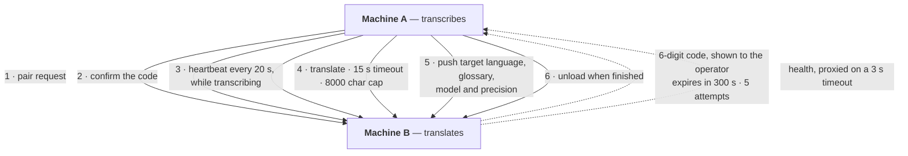

Pairing is **persisted**, so it survives a restart on both sides. B can serve several A's at
once, which is why an unload request is refused if any *other* trusted client has been seen in
the last 60 seconds. The glossary A pushes is held in memory for the session only and never
written to B's own dictionary. A box can be both A and B simultaneously — serving someone else's
translation request always translates locally, even on a machine that offloads its own captions.

---

## What flows back

The diagrams above are one-way; the system is not. Three paths run in reverse.

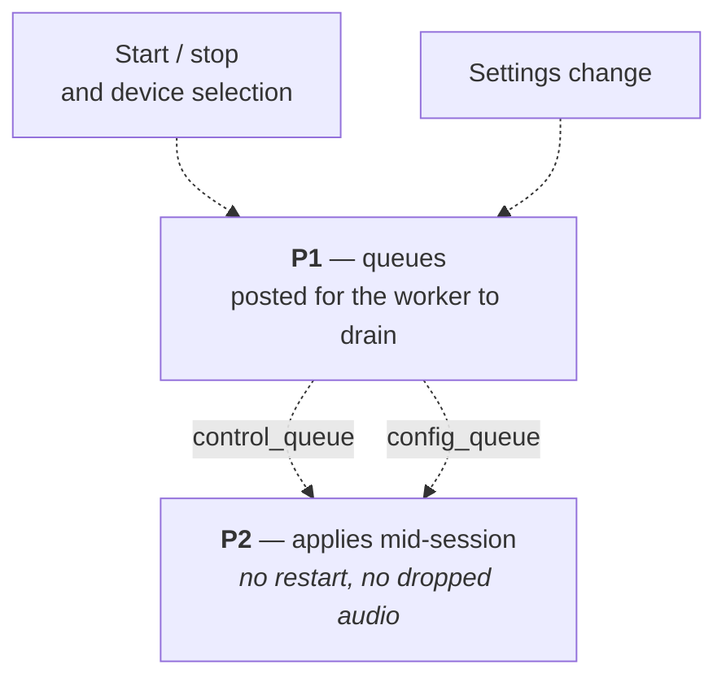

### Correcting a caption

Confidence is the **mean per-word probability** from Whisper's word timestamps — not
`avg_logprob`. A row below `corrections.confidence_threshold` (default `0.7`) is flagged
`needs_review` at insert time, in the worker, and surfaces in the corrections queue.

> **The queue is only populated if word timestamps are on.** They are requested only when
> `corrections.enabled` **and** `corrections.confidence_highlighting` are both true. Turn either
> off and every row stores `confidence = NULL`, nothing is ever flagged, and the review queue is
> permanently empty. The queue itself returns at most 50 rows, final and not denied.

Editing a row is not a cosmetic fix — the correction propagates.

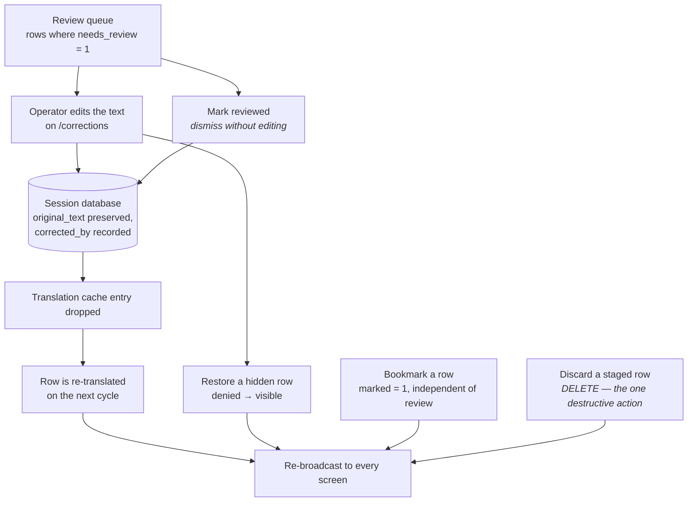

Three independent flags, often confused: **`needs_review`** is set by the worker from
confidence, **`denied`** is set by a filter or an operator and hides the row, and **`marked`** is
a purely manual bookmark with no automatic source. Deny and mark changes are pushed to every open
page on their own broadcasts rather than riding the normal entries payload.

The verbatim text is never overwritten — `original_text` keeps what the model actually produced
and `corrected_by` records who changed it, so a corrected transcript stays auditable. The same
page is where a row hidden by a filter gets restored.

**One exception to "nothing is deleted".** With the output delay on, discarding a staged segment
runs a real `DELETE` — it is the only place in the system where a row is destroyed rather than
hidden, and it exists so a mis-heard caption never reaches the audience or the transcript.

---

## Three timestamps

All three are written from the same instant, but they are not interchangeable.

| Column | Type | Mutable? | What it is for |
|--------|------|----------|----------------|
| `timestamp` | text, second resolution | **yes** — the output delay rewrites it | What exports and the UI display |
| `ts_ms` | epoch milliseconds | no | Arrival time. What makes replay faithful, and the only ordering key the service-phase detector uses |
| `translation_ts_ms` | epoch milliseconds | no | When the translation was written. Exists because translation arrives as a later async update, so the row's own `ts_ms` cannot show the lag a viewer actually experienced |

---

## What is being measured

Instrumentation runs in both processes and is wrapped so it can never break a caption.

| Metric | Where | Note |
|--------|-------|------|
| `infer_ms_ema`, `rtf_ema` | worker, after each decode | Pushed to shared state at most once a second, not per chunk |
| `segments_per_min`, `rows_saved` | worker | |
| `queue_depth` | worker | The **raw-audio passthrough** queue, max 10 — *not* a transcription backlog |
| local / remote translate ms | web | Comparing the two isolates network overhead from model time |
| TTS synthesis ms | web | |
| Access log | web | Every request except static assets, socket transport, and the dashboard polling endpoints (skipped by default); plus every Socket.IO action. Capped at 50,000 rows |

Real-time factor above `1.0` reads as degraded and above `1.5` as an error. All live metrics are
nulled when transcription is not running, so an idle machine never shows stale green.

The access log **drops the query string on purpose**, because it can carry an access token;
routes add their own curated detail instead.

---

## Batch file transcription is a different pipeline

Uploading a file does not run the live path. Almost every stage differs, which matters when
comparing output between the two.

| | Live | File |
|---|---|---|
| Audio | 1 s chunks into a rolling buffer | whole file, one decode |
| Model | `model` (default `small`) | `file_transcription.model` — a *different*, smaller default |
| beam_size | 3 | 5 |
| temperature | forced to 0.0 | fallback ladder 0.0 → 0.8 |
| VAD · PANNs · energy gate | yes | none |
| Filters | six | profanity only |
| Confidence / review queue | yes | none |
| Session database | every row written | nothing written — segments go straight to the browser |
| Translation | dispatcher + cache | own chain, no cache |

The file path also unloads Whisper before loading a translator, making the VRAM hand-off
explicit, and always clears the model cache afterwards so a file job cannot poison the live one.

---

## On stop

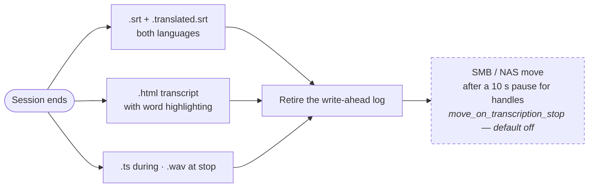

The write-ahead log is retired *before* anything is moved, so what leaves the machine is a single
portable file rather than a database plus sidecars.

---

## Where each stage lives

Symbols rather than line numbers — line numbers in a document go stale the first time anyone
edits the file, and these did. Search for the name.

| Stage | Where |
|-------|-------|
| Process split — why spawn, not fork | `thread1_function` · `thread2_function` |
| Shared state proxy | `transcription_state` |
| ffmpeg capture loop | `stt/audio_capture.py` — `FFmpegAudioCapture._capture_loop` |
| Rolling buffer / clip rule | `WhisperLiveTranscriber.add_frames` |
| VAD + music bypass | `has_speech` (nested in the transcribe loop) |
| PANNs detector thread | `MusicDetector` · `compute_music_prob` · `stt/segments.py` — `panns_label_from_prob` |
| Whisper decode params | `LIVE_TRANSCRIPTION_PARAMS` · `ModelFactory.transcribe` |
| Finalisation rule | `WhisperLiveTranscriber.update_segments` |
| Live-line stabiliser | `stt/hypothesis_buffer.py` — `LocalAgreementBuffer.stabilize` |
| Sentence split + pending buffer | `stt/text_utils.py` — `split_into_sentences`, `remove_overlapping_prefix` |
| Filters | `stt/text_utils.py` — `filter_hallucinated_text`, `is_whisper_hallucination`, `is_fuzzy_duplicate`, `apply_profanity_filter` |
| Emit loops | `emit_new_entries` · `emit_translated_entries` · `emit_audio_stream` · `emit_tts_audio` |
| Translation dispatcher | `translate_live_text` |
| Remote / LLM / NMT legs | `_translate_via_remote` · `_translate_via_llm` · `translate_text` |
| LLM validation | `stt/llm_translate.py` — `validate_translation` |
| Model load / unload | `ModelFactory.load_model` · `get_live_translation_model` · `get_local_llm` · `unload_local_llm` |
| Device ladder | `ModelFactory.load_model` (CUDA → MPS → CPU) · `_load_faster_whisper` (CUDA → CPU only) |
| Calibration | `/api/calibration/start` · `stt/calibration.py` — `analyze_calibration_data` |
| Auth gate | `check_ip_whitelist` · `_socket_auth_ok` |
| Output delay / staging | `_backdate_staged_rows` · `handle_approve_staged` · `handle_discard_staged` |
| Review queue · mark · deny | `get_review_queue` · `handle_set_segment_marked` · `handle_set_segment_denied` |
| Remote pairing + heartbeat | `/api/translate/pair/*` · `_remote_heartbeat_loop` |
| Session provenance | `stt/session_meta.py` · `_current_session_meta` |
| Service phase detector | `stt/service_phase.py` · `_service_phase_tick` |
| Metrics + access log | `stt/metrics.py` · `stt/request_log.py` · `_access_log_record` |
| Watchdog + self-update | `stt/watchdog.py` — `CrashRecoveryThread`, `AutoUpdater` · `stt/self_update.py` |
| Batch file path | `process_file_transcription` |
| Teardown / exports | `stt/formatting.py` — `convert_db_to_srt` · `stt/file_mover.py` |
| TTS | `synthesize_tts` · `emit_tts_audio` |
| Timezone resolution | `stt/config_utils.py` — `resolve_timezone` · `get_configured_timezone` |

-------|-----------|
| Process split — why spawn, not fork | `speech_to_text.py:2986-3000` |
| Shared state proxy (26 declared keys) | `speech_to_text.py:3023` |
| ffmpeg capture loop | `stt/audio_capture.py:151` · `:284` |
| Rolling buffer / clip rule | `speech_to_text.py:2706-2723` |
| VAD + music bypass | `speech_to_text.py:16266` · `:16901` |
| PANNs detector thread | `speech_to_text.py:3354-3432` · `stt/segments.py:8` |
| Whisper decode params | `speech_to_text.py:316` · `:17013` |
| Loudness normalisation (off by default) | `speech_to_text.py:16938-16955` |
| Context prompt from saved rows | `speech_to_text.py:16983-17007` |
| Overlap de-duplication | `stt/text_utils.py:333` |
| Finalisation rule | `speech_to_text.py:2758-2918` |
| Live-line stabiliser | `stt/hypothesis_buffer.py:34` |
| Sentence split + pending buffer | `stt/text_utils.py:152` · `speech_to_text.py:17180` |
| Filters | `speech_to_text.py:17214-17244` |
| Row insert + partials | `speech_to_text.py:17208` · `:17670` |
| Emit loops | `speech_to_text.py:14243` · `:14826` |
| Translation dispatcher | `speech_to_text.py:14735` |
| LLM validation | `stt/llm_translate.py:335` |
| Service phase detector | `stt/service_phase.py` · `speech_to_text.py:14184` |
| Teardown / exports | `speech_to_text.py:17955-18030` · `stt/file_mover.py:445` |
| Calibration | `speech_to_text.py:5064` · `:16662` · `stt/calibration.py:35` |
| Model load / unload | `speech_to_text.py:1679` · `:2057` · `:15663` · `:10166` |
| Device ladder — CUDA → MPS → CPU | `speech_to_text.py:2087-2092` · `:997-1010` |
| Auth gate | `speech_to_text.py:4248` · socket gate `:13476` |
| Display profiles | `speech_to_text.py:4174` · `:5519` |
| Review queue · mark · deny · stage | `:10441` · `:13994` · `:13952` · `:13890-13948` |
| Remote pairing + heartbeat | `speech_to_text.py:7154-7434` · `:6483` |
| Session provenance | `stt/session_meta.py` · `speech_to_text.py:1082` · `:3739` |
| Metrics + access log | `stt/metrics.py` · `stt/request_log.py` · `:3915` |
| Watchdog + self-update | `stt/watchdog.py:1505` · `:1884` · `stt/self_update.py` |
| Batch file path | `speech_to_text.py:8390` |

---

Palette and typography for the UI these stages feed are documented in [DESIGN.md](DESIGN.md).
Installation and system requirements are in [INSTALL.md](INSTALL.md).
