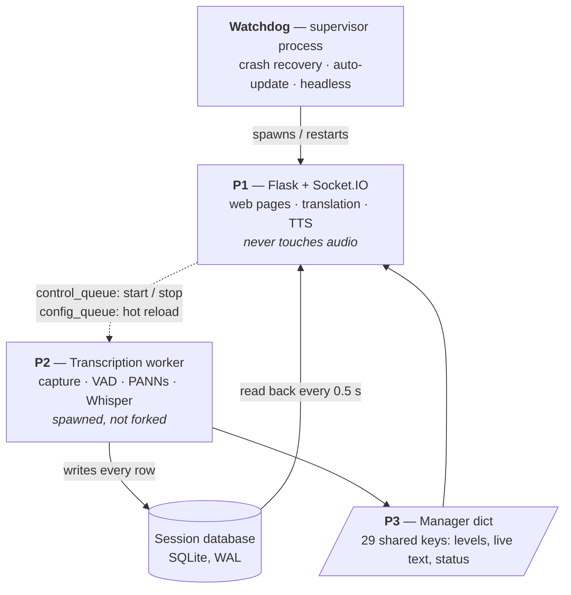
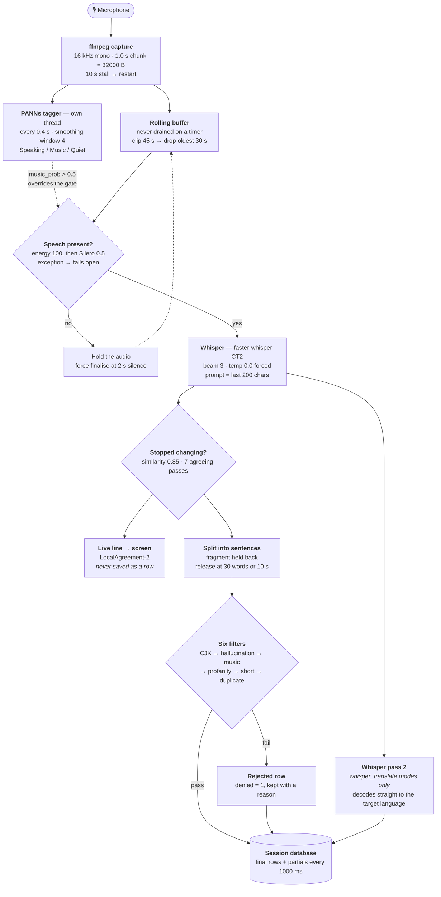
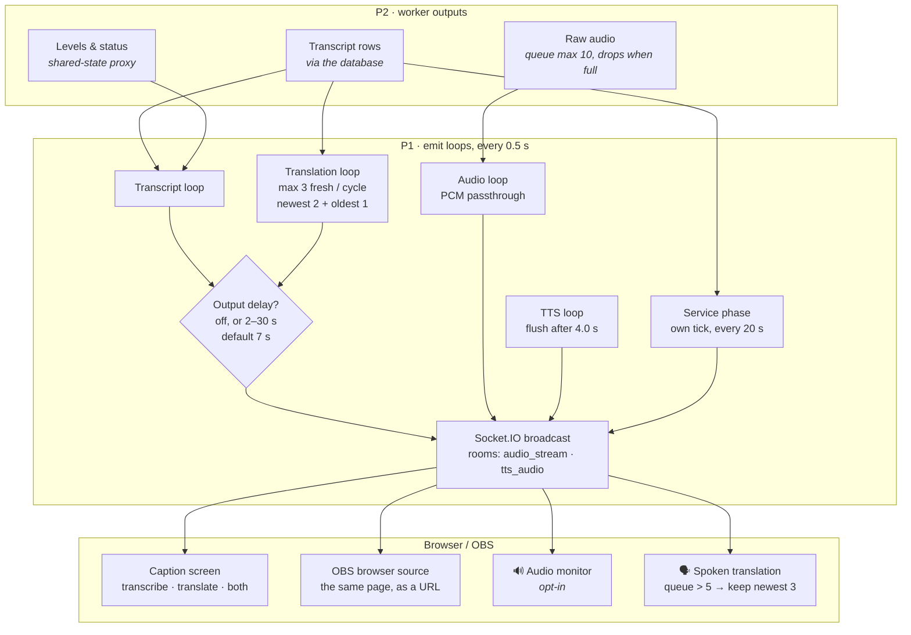
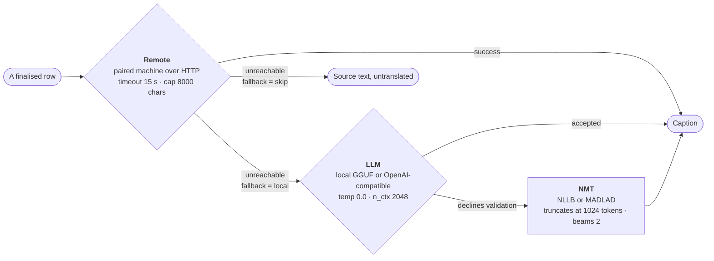
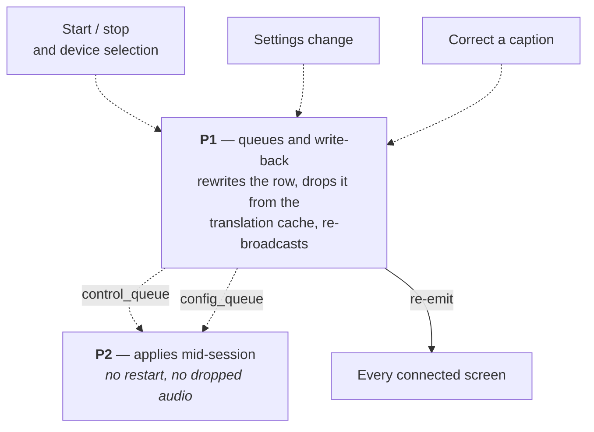
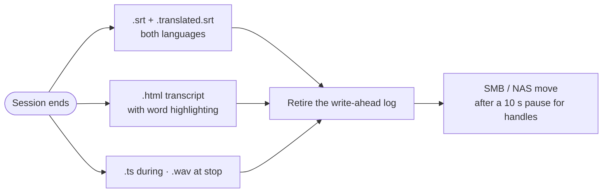

# Pipeline — from microphone to caption

How one second of audio becomes a caption on screen. Every number here is the shipped default
from `config/config.default.json`.

- [Four processes, not one](#four-processes-not-one)
- [Live audio to a saved row](#live-audio-to-a-saved-row)
- [Why a row was hidden](#why-a-row-was-hidden)
- [Delivery](#delivery)
- [Translation](#translation)
- [What flows back](#what-flows-back)
- [On stop](#on-stop)
- [Where each stage lives](#where-each-stage-lives)

---

## Four processes, not one

The most misleading thing about reading the source top to bottom: capture and transcription do
not run in the web server. They run in a separate spawned process, and the two communicate only
through a `multiprocessing.Manager` dict and the session database.

**Why spawn, not fork.** A forked child inherits the parent's CUDA context and dies on
`Cannot re-initialize CUDA in forked subprocess`, so the start method is forced to `spawn` and
shared objects are passed as pickled arguments instead of inherited.

---

## Live audio to a saved row

All inside the worker process. Dotted arrows are influences rather than data hand-offs.

**Music always wins.** A confident music reading forces the gate to accept, so singing is always
transcribed; `transcribe_detected_music` decides only whether the row is *shown*.

---

## Why a row was hidden

Nothing is deleted. A rejected row is written with a reason so the corrections page can restore
it. `denied_reason` is the complete vocabulary — the first rule to fire wins.

| Order | `denied_reason` | Fires when |
|-------|-----------------|------------|
| 1 | `cjk` | CJK characters in a non-CJK session — a classic Whisper artefact |
| 1b | `cjk_shadow` | Partial strip: the cleaned text is saved *and* the original kept beside it |
| 2 | `hallucination` | Substring match against known artefact stems (subtitle credits, "thank you for watching") |
| 3 | `music:0.5` | Tagged Music while `transcribe_detected_music` is off. The threshold is baked into the reason so the corrections page can compare against the row's own value |
| 4 | *(none)* | Profanity filter — rewrites the text in place and keeps the verbatim original. Not a rejection |
| 5 | `short` | Fewer words than `min_words`. Off by default |
| 6 | `dup` | Fuzzy match ≥ 0.85 against anything already saved this session |

---

## Delivery

Text is only one of three things leaving the worker. Raw audio is forwarded on its own bounded
queue, and levels and status travel through the shared-state proxy without touching the database.

**Output delay** holds captions so an operator can correct a row before the audience ever sees
it; released rows are back-dated to their real time. **Rooms** mean audio and speech only reach
clients that explicitly joined, so a caption screen is never sent audio it will not play.

---

## Translation

Four paths, one dispatcher. Declining is an ordinary outcome, not an error — a wrong caption in
front of a congregation is worse than a slower one.

**The fourth path skips all three.** In `whisper_translate` modes the translation is produced in
the worker by decoding the audio a second time, so it never reaches this dispatcher — the web
process only reads the result.

**The LLM's answer is thrown away when:**

| Rejected when | Because |
|---------------|---------|
| It refuses — *"I can't assist…"*, *"As an AI…"* | A refusal is not a translation |
| It narrates — *"Okay, let's…"*, *"Here's the translation:"* | Reasoning models ignore instructions to stop |
| Cyrillic survives into a Latin-script target | The source leaked through untranslated |
| The output is multi-paragraph | A caption is one utterance; a document is a recitation |
| It runs past `min(3 × source words, source + 24)` | Commentary and recited scripture present as length |
| The input would not fit the context window | Checked *before* generating, so an overflow is a decline and never a crash |

Each caption is an independent two-message call — nothing accumulates between sentences, so
there is no context to clear.

---

## What flows back

The diagrams above are one-way; the system is not.

---

## On stop

The write-ahead log is retired *before* anything is moved, so what leaves the machine is a single
portable file rather than a database plus sidecars.

---

## Where each stage lives

| Stage | Reference |
|-------|-----------|
| Process split — why spawn, not fork | `speech_to_text.py:2986-3000` |
| Shared state proxy (29 keys) | `speech_to_text.py:3023` |
| ffmpeg capture loop | `stt/audio_capture.py:151` · `:284` |
| Rolling buffer / clip rule | `speech_to_text.py:2706-2723` |
| VAD + music bypass | `speech_to_text.py:16266` · `:16901` |
| PANNs detector thread | `speech_to_text.py:3354-3432` · `stt/segments.py:8` |
| Whisper decode params | `speech_to_text.py:316` · `:17013` |
| Finalisation rule | `speech_to_text.py:2758-2918` |
| Live-line stabiliser | `stt/hypothesis_buffer.py:34` |
| Sentence split + pending buffer | `stt/text_utils.py:152` · `speech_to_text.py:17180` |
| Filters | `speech_to_text.py:17214-17244` |
| Row insert + partials | `speech_to_text.py:17208` · `:17670` |
| Emit loops | `speech_to_text.py:14243` · `:14826` |
| Translation dispatcher | `speech_to_text.py:14735` |
| LLM validation | `stt/llm_translate.py:335` |
| Service phase detector | `stt/service_phase.py` · `speech_to_text.py:14184` |
| Teardown / exports | `speech_to_text.py:17955-18030` · `stt/file_mover.py:445` |

---

Palette and typography for the UI these stages feed are documented in [DESIGN.md](DESIGN.md).
Installation and system requirements are in [INSTALL.md](INSTALL.md).
